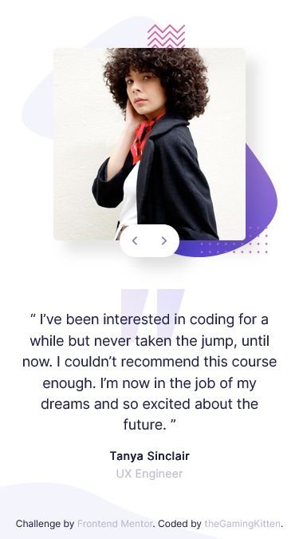

# Frontend Mentor - Coding bootcamp testimonials slider solution

This is a solution to the [Coding bootcamp testimonials slider challenge on Frontend Mentor](https://www.frontendmentor.io/challenges/coding-bootcamp-testimonials-slider-4FNyLA8JL). Frontend Mentor challenges help you improve your coding skills by building realistic projects. 

## Table of contents

- [Overview](#overview)
  - [The challenge](#the-challenge)
  - [Screenshots](#screenshots)
  - [Links](#links)
- [My process](#my-process)
  - [Built with](#built-with)
  - [What I learned](#what-i-learned)
  - [Continued development](#continued-development)
  - [Useful resources](#useful-resources)
- [Author](#author)

## Overview

### The challenge

Users should be able to:

- View the optimal layout for the component depending on their device's screen size
- Navigate the slider using either their mouse/trackpad or keyboard

### Screenshot

### Links

- Solution URL: [Source code](https://github.com/theGamingKitten/coding-bootcamp-testimonials-slider-master)
- Live Site URL: [Preview](https://your-live-site-url.com)

## My process

### Built with

- Semantic HTML5 markup
- CSS custom properties
- Flexbox
- CSS Grid
- Mobile-first workflow
- [React](https://reactjs.org/) - JS library

### What I learned

Positioning the slider right was the biggest problem for me. In the end I decided to just position it right at mobile (375px), tablet (768px) and desktop (1440px) size.

### Continued development

Finishing projects even when they are not 100% working is better than giving up on the challenge completely. I can always come back later and improve my solutions when I've learned more.

Still need to learn a lot about passing down props and using them in the child component. And also about hooks in React.

### Useful resources

- [FreeCodeCamp News](https://www.freecodecamp.org/news/build-an-image-carousel-with-react-and-framer-motion/) - I implemented the slider using this tutorial

## Author

- Frontend Mentor - [@theGamingKitten](https://www.frontendmentor.io/profile/theGamingKitten)